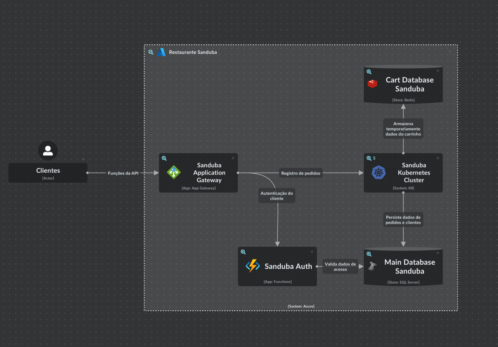

# tech-challenge-fiap-database-terraform

Terraform para criação da infraestrutura de banco de dados (SQL Server e REDIS), assim como scripts para deployment.

Integrações da aplicação e banco de dados:
</img>

Para a escolha dos bancos de dados decidi por utilizar como bando principal o SQL Server e o REDIS para armazenar as informações de carrinho.

Algumas das vantagens para a utilização de um banco de dados SQL (relacional) para esse cenário serão:
* Consistência dos dados: Aqui quero garantir o ACID (Atomicidade, Consistência, Isolamento, Durabilidade) proporcionado pelo bando de dados relacional, onde não tenho grande necessidade de otimização das consultas e escritas;
* Não prevejo grandes mudanças nas estruturas armazenadas relacionadas aos pedidos, não sendo necessário uma flexibilidade grande da estrutura;
* Vou conseguir otimizar as consultas de historico e relacionamento dos produtos de forma que podemos tomar açÕes de publicidades pelos dados extraidos da base.

Para isso criei as tabelas:

* Clientes: para persistencia dos dados cadastrais dos clientes;
* Produtos: para persistência dos itens oforecidos no cardápio do restaurante;
* Pedidos e Itens de pedidos: relacionar e persistir os pedidos feitos pelos clientes assim como a mudança de estado conforme a evolução do preparo e pagamento;
* Pagamento: Armazenamento dos dados dos pagamentos efetuados;

Já a utilização de um NoSQL (Não relacioal) como banco para armazenar os dados de carrinho foi baseado no fato de ser um dado efêmero, ou seja, no melhor dos cenários o cliente sempre deve finalizar o pedido, assim, tudo que em algum momento foi adicionado no carrinho estaria persistido na base SQL SERVER. Além disso ainda possui grande possibilidade de alteração (adicionar novos produtos, remover, limpar o carrinho ou até a desistência), assim utilizar o REDIS como solução trouxe grandes vantagens:
* Rapidez na escrita e leitura: graças ao armazenamento em memória RAM, este banco possui ótima performance em operações que não sejam complexa;
* Simplicidade do dado: em uma lista de carrinho é tão simples quanto associar ao ID do cliente qual a lista de itens selecionados em tela. Assim usando uma estrutura de chave(ID do cliente) e valor (lista de produtos);
* Pouca criticidade dos dados: por não se tratar de dados transacionais, caso o dado se perca ou expire (abandono do carrinho) não seria um grande problema, visto que o cliente ainda não finalizou a compra.

Conforme a solução evolua, podemos avaliar a utilização de outros NoSQL (do tipo documento por exemplo) para flexibilizar integração com outros provedores de pagamentos, além do mercado pago, onde cada provedor possui seu formato de comunicação e dados transmitidos. Vale também a utilzação de um banco de séries temporais para analise do consumo dos usuário e prever promoções ou pesquisas feitas e não concluidas.